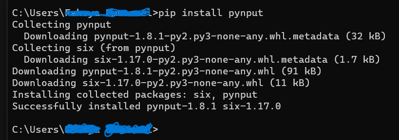
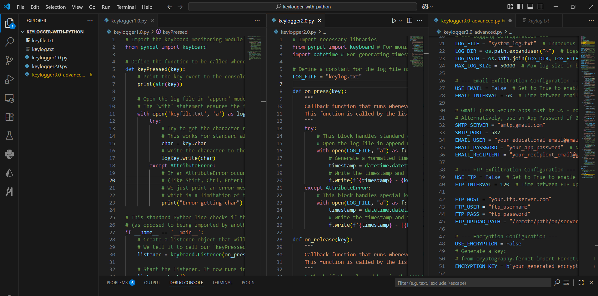

# Project: Keylogger Implementation Series (Python)

## Overview
This project demonstrates the evolution of keylogger implementations for educational purposes, ranging from basic keystroke capture to advanced stealth techniques with multiple exfiltration methods. The series showcases progressive cybersecurity concepts through three distinct versions, each building upon the previous implementation.

---

## Disclaimer!!!
This software is intended for educational purposes only. The developer assumes no liability and is not responsible for any misuse or damage caused by this program. It is the end user's responsibility to obey all applicable local, state, and federal laws.

Only use these tools on systems you own or have explicit written permission to test. Unauthorized use of keyloggers may violate privacy laws and can lead to severe legal consequences.

## Use Case Scenario 
A corporate security team uses these keylogger variants in controlled red team exercises to test endpoint detection and response (EDR) systems, ensuring they can detect and block such threats before malicious actors can exploit them.

## Keylogger Versions
- Keylogger 1.0: Basic keystroke capture, file logging, minimal error handling, and basic file management
- Keylogger 2.0: Enhanced version with timestamp functionality, improved special key handling, and graceful exit mechanism
- Keylogger 3.0: Advanced: Multiple exfiltration methods, encryption, stealth operation, and persistence

---

## Configuration & Screenshots

### 1. Environment Setup
- Installed required Python packages using pip
- Configured development environment in VS Code
- Prepared testing environment for keylogger execution


*Installing required Python packages for keylogger functionality*

### 2. Development Environment
- Configured VS Code with all three keylogger versions
- Maintained clean code organization and version control
- Prepared for simultaneous testing and comparison


*Development environment showing all three keylogger implementations*

### 3. Keylogger 1.0 - Basic Implementation
- Simple keystroke capture functionality
- Basic file logging to text format
- Minimal error handling and features
- Press Enter key to exit in terminal

### 4. Keylogger 2.0 - Enhanced Version
- Added timestamp functionality
- Improved special key handling
- Graceful exit mechanism with ESC key
- Better file management and formatting

### 5. Keylogger 3.0 - Advanced Implementation
- Multiple exfiltration methods (Email, FTP)
- Encryption capabilities
- Process and window tracking
- Persistence mechanisms
- Stealth operation modes

### 6. Execution and Testing
- Ran each keylogger version to verify functionality
- Tested different capture scenarios
- Validated output file generation
- Verified stealth operation capabilities


*Keylogger execution and output verification*

### 7. Output Analysis
- Examined generated log files
- Verified timestamp accuracy
- Tested special key capture
- Validated encryption functionality


*Generated log file analysis and content verification*

---

## Observations and Challenges

### Technical Challenges
- **Antivirus Detection**: Modern AV solutions detected keylogging behavior
- **Permission Requirements**: Admin rights needed for persistence features

### Security Considerations
- **Detection Risks**: More AV solutions flagged the applications
- **Network Visibility**: Exfiltration methods created detectable patterns
- **Forensic Evidence**: Log files and artifacts remained discoverable
- **Legal Implications**: Important ethical and legal boundaries noted

### Legal Warning
Unauthorized use of keyloggers may violate:
- Computer Fraud and Abuse Act (CFAA)
- Electronic Communications Privacy Act (ECPA)
- Various state computer intrusion laws
- Privacy laws in many international jurisdictions
- Penalties can include fines and imprisonment. Always ensure you have proper authorization.

---

## How to Reproduce

### Prerequisites
- Python 3.8+ installed
- Windows operating system (for advanced features)
- Administrative privileges (for persistence features)
- External email/FTP accounts (for exfiltration testing)

### Installation Steps

1. **Environment Setup**
```bash
# Install required packages
pip install pynput cryptography pywin32 psutil
```

2. **Basic Keylogger Execution**
```bash
# Run basic keylogger
python keylogger1.0.py
```

3. **Enhanced Keylogger Testing**
```bash
# Run enhanced version
python keylogger2.0.py
# Press ESC to stop
```

4. **Advanced Keylogger Configuration**
```bash
# Edit configuration in keylogger3.0_advanced.py
# Set appropriate values for:
# - EMAIL_USER, EMAIL_PASSWORD
# - FTP_HOST, FTP_USER, FTP_PASS
# - ENCRYPTION_KEY
```

5. **Advanced Execution**
```bash
# Run in debug mode
python keylogger3.0_advanced.py

# Run in stealth mode
python keylogger3.0_advanced.py stealth
```
